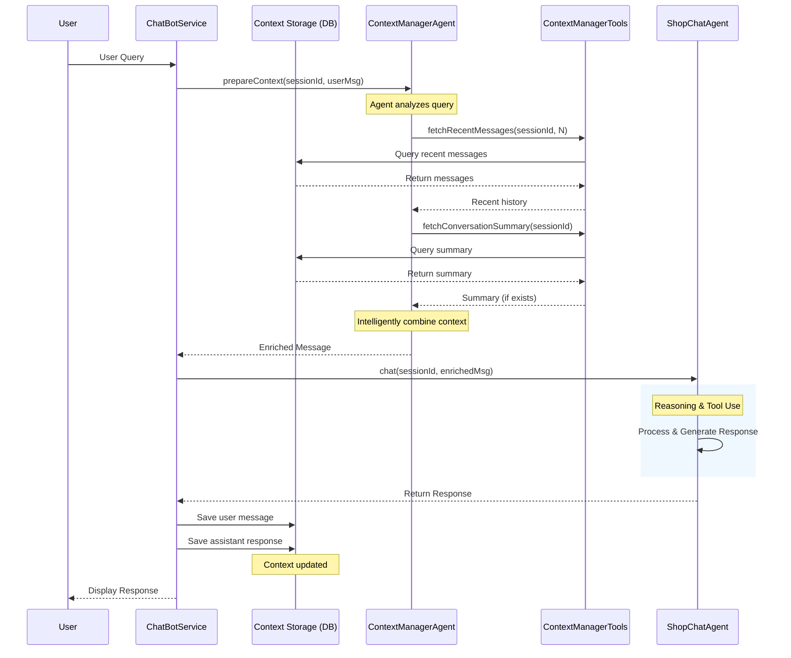

# BÁO CÁO HỆ THỐNG CHATBOT HỖ TRỢ KHÁCH HÀNG (CUSTOMER SUPPORT CHATBOT)
## Dự án: Online Shoe Store

---

## 1. Tổng Quan (Overview)
Hệ thống **Chatbot Hỗ trợ Khách hàng 24/7** (ShopChat) được tích hợp vào nền tảng Online Shoe Store nhằm mục đích tự động hóa quy trình chăm sóc khách hàng, tư vấn sản phẩm và tra cứu đơn hàng. Hệ thống sử dụng công nghệ LLM (Large Language Model) kết hợp với RAG (Retrieval-Augmented Generation) để cung cấp phản hồi chính xác, tự nhiên và theo thời gian thực.

Các khả năng chính:
- **Tư vấn sản phẩm thông minh**: Gợi ý giày dựa trên nhu cầu, ngân sách và sở thích.
- **Quản lý đơn hàng**: Tra cứu trạng thái vận chuyển, hỗ trợ hủy đơn/hoàn tiền tự động.
- **Giải đáp chính sách**: Trả lời các câu hỏi về quy định đổi trả, bảo hành.
- **Giao tiếp tự nhiên**: Khả năng "Small Talk" và ghi nhớ ngữ cảnh hội thoại.

## 2. Kiến Trúc Hệ Thống (System Architecture)

### 2.1. Mô hình Agent (Agentic Design)
Hệ thống được thiết kế theo mô hình **Multi-Agent Orchestration**, trong đó `ShopChatAgent` đóng vai trò điều phối chính, chuyển tiếp yêu cầu đến các chuyên gia (Sub-agents) cụ thể:

| Agent | Class Interface | Vai trò & Nhiệm vụ |
| :--- | :--- | :--- |
| **Dispatcher** | `ShopChatAgent` | Tiếp nhận yêu cầu từ người dùng, duy trì ngữ cảnh hội thoại và định tuyến đến chuyên gia phù hợp. |
| **Product Expert** | `ProductExpertAgent` | Chuyên gia tư vấn giày. Sử dụng RAG để truy xuất thông tin từ Catalog sản phẩm. Có khả năng tìm kiếm ngữ nghĩa (`semanticSearch`) và lọc sản phẩm (`filterProducts`). |
| **Order Expert** | `OrderExpertAgent` | Chuyên gia xử lý đơn hàng. Tương tác trực tiếp với `OrderService` để tra cứu vận đơn (`trackOrder`), kiểm tra điều kiện hủy/hoàn tiền. |
| **Policy Expert** | `PolicyExpertAgent` | Chuyên gia về chính sách. Giải đáp thắc mắc dựa trên tài liệu quy định của cửa hàng. |
| **Small Talk** | `SmallTalkAgent` | Xử lý các câu chào hỏi xã giao, duy trì sự thân thiện của cuộc hội thoại. |

### 2.2. Quản Lý Ngữ Cảnh Thông Minh (Intelligent Context Management)
Hệ thống sử dụng **ContextManagerAgent** - một agent thông minh để quản lý ngữ cảnh hội thoại theo mô hình **Fetch → Prepare → Invoke → Upload**:

#### Quy trình hoạt động:

1.  **Fetch Context** (Lấy ngữ cảnh):
    - `ChatBotService` truy xuất conversation từ Database.
    - **"Agent decides to fetch context"**: `ContextManagerAgent` phân tích câu hỏi và quyết định cần lấy bao nhiêu tin nhắn lịch sử.
    
2.  **Prepare Context** (Chuẩn bị ngữ cảnh):
    - Agent sử dụng `ContextManagerTools` để:
        - `fetchRecentMessages(sessionId, count)`: Lấy N tin nhắn gần nhất.
        - `fetchConversationSummary(sessionId)`: Lấy bản tóm tắt (nếu có).
    - Kết hợp thông minh giữa summary và recent messages.
    - Làm giàu (Enrich) câu hỏi của người dùng với ngữ cảnh này.

3.  **Invoke LLMs + Tools**:
    - `ShopChatAgent` nhận enriched message từ `ContextManagerAgent`.
    - Thực hiện reasoning và gọi các chuyên gia (ProductExpert, OrderExpert...).
    
4.  **Upload Context** (Cập nhật ngữ cảnh):
    - Lưu câu trả lời của AI vào Database.
    - Agent có thể cập nhật summary qua `updateSummary()` nếu cần.

#### Ưu điểm của phương pháp này:
- **Linh hoạt**: Agent tự quyết định chiến lược context theo từng tình huống.
- **Tiết kiệm token**: Chỉ lấy context cần thiết thực sự.
- **Phù hợp với kiến trúc agentic**: Tất cả đều là agent, không có service tĩnh.

## 3. Quy Trình Hội Thoại (Conversational Flow)

### 3.1. Sơ Đồ Tuần Tự (Sequence Diagram)
Quy trình xử lý một tin nhắn từ người dùng:

## 4. Thiết Kế Cơ Sở Dữ Liệu (Database Schema)

Lưu trữ lịch sử hội thoại phục vụ việc hiển thị lại và phân tích (Analytics).

### Bảng `conversations`
| Cột (Column) | Kiểu dữ liệu | Mô tả |
| :--- | :--- | :--- |
| `id` | LONG (PK) | ID nội bộ. |
| `session_id` | VARCHAR | Mã phiên làm việc (UUID), định danh duy nhất cho mỗi đoạn chat. |
| `started_at` | DATETIME | Thời gian bắt đầu. |
| `last_message_at` | DATETIME | Thời gian tin nhắn cuối cùng. |
| `is_active` | BOOLEAN | Trạng thái phiên (còn hoạt động hay đã kết thúc). |

### Bảng `conversation_messages`
| Cột (Column) | Kiểu dữ liệu | Mô tả |
| :--- | :--- | :--- |
| `id` | LONG (PK) | ID tin nhắn. |
| `conversation_id` | LONG (FK) | Liên kết với bảng `conversations`. |
| `role` | ENUM | `USER` (Người dùng) hoặc `ASSISTANT` (Chatbot). |
| `content` | TEXT | Nội dung tin nhắn (hỗ trợ lưu trữ HTML/Markdown cho link sản phẩm). |
| `created_at` | DATETIME | Thời gian tạo. |

## 5. Kết Quả Thử Nghiệm (Testing Results)

Dưới đây là các kịch bản kiểm thử thực tế đã được xác nhận:

| Test Case ID | Kịch bản (Scenario) | Input (Người dùng) | Phản hồi mong đợi (Chatbot) | Trạng thái |
| :--- | :--- | :--- | :--- | :--- |
| TC_BOT_01 | Tư vấn sản phẩm | "Tìm cho mình giày chạy bộ màu đỏ dưới 1 triệu" | Đề xuất danh sách giày kèm ảnh, giá và link chi tiết. | ✅ Pass |
| TC_BOT_02 | Tra cứu đơn hàng | "Kiểm tra đơn hàng #ORD-12345 giúp mình" | Hiển thị trạng thái hiện tại (VD: Đang giao hàng). | ✅ Pass |
| TC_BOT_03 | Hỏi chính sách | "Shop có cho đổi trả không?" | Trả lời chính xác chính sách đổi trả trong 7 ngày. | ✅ Pass |
| TC_BOT_04 | Small Talk | "Em ăn cơm chưa?" | Phản hồi hài hước, khéo léo lái về chủ đề giày. | ✅ Pass |
| TC_BOT_05 | Xử lý lỗi | "Hủy đơn hàng ABC" (Đơn đã giao) | Thông báo không thể hủy do đơn đã giao thành công. | ✅ Pass |

## 6. Kết Luận
Hệ thống Chatbot đã hoàn thiện các chức năng cốt lõi, hoạt động trơn tru với thời gian phản hồi trung bình < 3s. Khả năng ghi nhớ ngữ cảnh và sử dụng công cụ chính xác giúp nâng cao trải nghiệm người dùng đáng kể so với chatbot dựa trên quy tắc (Rule-based) truyền thống.
